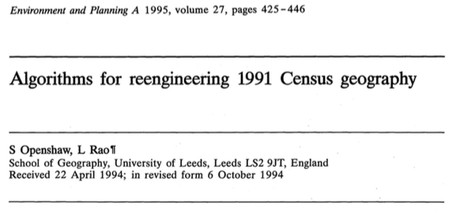

#
## Geographic Data Science

Regionalisation

[Dani Arribas-Bel](http://darribas.org)

#
## Regionalization
## 

Unsupervised **Spatial** Machine Learning

*Aggregating basic spatial units (**areas**) **into** larger units (**regions**)*

## Regionalization

**Split** a dataset into **groups** of observations that are **similar within** the group
and **dissimilar between** groups, based on a series of 
**attributes**...

 ...with the additional constraint observations need to be
**spatial neighbors**

## Regionalization {data-transition=none}

<SMALL>
<ul>
<li class="fragment current-visible"> All the methods aggregate geographical areas into a predefined number of regions, while optimizing a particular aggregation criterion; </li>
<li class="fragment current-visible"> The areas within a region must be geographically connected (the spatial contiguity constraint); </li>
<li class="fragment current-visible"> The number of regions must be smaller than or equal to the number of areas; </li>
<li class="fragment current-visible"> Each area must be assigned to one and only one region; </li>
<li class="fragment current-visible"> Each region must contain at least one area. </li>
</ul>
</SMALL>

[Duque et al. (2007)](http://irx.sagepub.com/content/30/3/195)

## Regionalization {data-transition=none}

<SMALL>
<ul>
<li> All the methods aggregate geographical areas into a predefined number of regions, while optimizing a particular aggregation criterion;</li>
<li> The areas within a region must be geographically connected (the spatial contiguity constraint); </li>
<li> The number of regions must be smaller than or equal to the number of areas; </li>
<li> Each area must be assigned to one and only one region;</li>
<li> Each region must contain at least one area. </li>
</ul>
</SMALL>

[Duque et al. (2007)](http://irx.sagepub.com/content/30/3/195)

## {data-background=../figs/l08_abb_london.png}

## Algorithms

* Automated Zoning Procedure (AZP)
* Arisel
* Max-P
* ...

See [Duque et al. (2007)](http://irx.sagepub.com/content/30/3/195) for an
excellent, though advanced, overview

#
## Examples

## Census geographies {data-transition=none}

## {data-background=../figs/l08_livehoods.png data-transition=none}

[Livehoods](http://www.livehoods.org/)

#

 A course on Geographic Data Science by <a xmlns:cc="http://creativecommons.org/ns#" href="http://darribas.org" property="cc:attributionName" rel="cc:attributionURL">Dani Arribas-Bel</a> is licensed under a <a rel="license" href="http://creativecommons.org/licenses/by-sa/4.0/">Creative Commons Attribution-ShareAlike 4.0 International License</a>.
