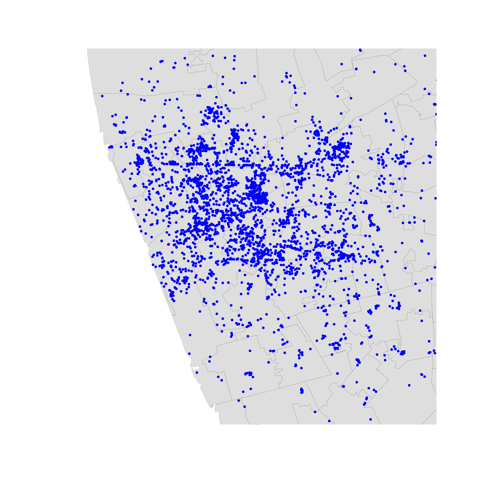
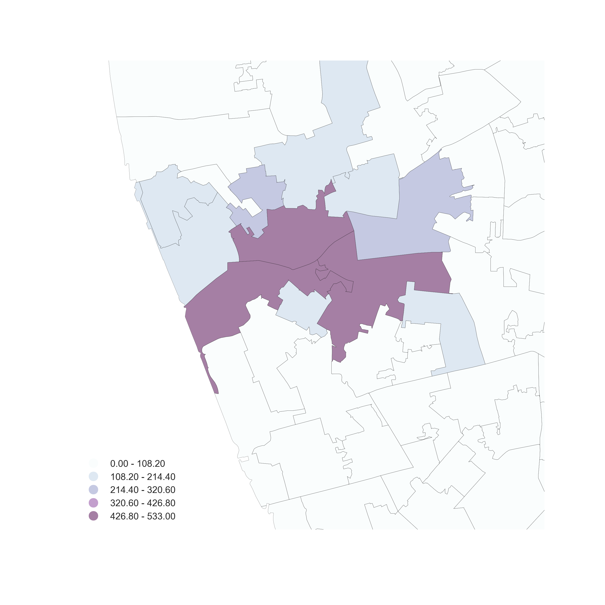

#
## Geographic Data Science

Visualisation of Point Patterns

[Dani Arribas-Bel](http://darribas.org)

#
## Visualization of PPs

Three routes (today):

* *One-to-one* mapping  $\leftrightarrow$ "Scatter plot"
* *Aggregate*  $\leftrightarrow$ "Histogram"
* *Smooth*  $\leftrightarrow$ KDE

#
## One-to-one
## One-to-one
    
- Intuitive 
- Effective in small datasets
- Limited as size increases until useless

## One-to-one
    

   
#
## Aggregation
##

*Points meet polygons*

 Use **polygon** boundaries and **count** points per area

 [Insert your skills for **choropleth mapping** here!!!]

 **But**,  the polygons need to *"make sense"* (their
delineation needs to relate to the point generating process)

## 

 

## Hex-binning

If **no** polygon boundary seems like a **good candidate** for aggregation...

 ...draw a **hexagonal** (or squared) **tesselation**!!!

Hexagons...

* Are **regular**
* **Exhaust** the space (Unlike circles)
* Have **many sides** (minimize boundary problems)

## 

 

 

## But...

(Arbitrary) aggregation may induce **MAUP** (see Block D)

$+$

Points usually represent events that affect only **part** of the population
and hence are best considered as **rates**

#
## Kernel Density Estimation
## Kernel Density Estimation

*Estimate the (**continuous**) observed **distribution** of a variable*

* Probability of finding an observation at a given point
* "Continuous histogram"
* Solves (much of) the MAUP problem, but not the underlying population issue

## {data-background=../figs/l09_kde.png data-background-size=contain}

[[Source](https://en.wikipedia.org/wiki/Kernel_density_estimation#/media/File:Comparison_of_1D_histogram_and_KDE.png)]

## Bivariate (spatial) KDE

*Probability of finding observations at a given point in space*

* **Bivariate** version: distribution of **pairs of values**
* In **space**: values are coordinates (XY), locations
* Continuous "version" of a choropleth

## {data-background=../figs/l09_kde2d.png}

## 

 

#

 A course on Geographic Data Science by <a xmlns:cc="http://creativecommons.org/ns#" href="http://darribas.org" property="cc:attributionName" rel="cc:attributionURL">Dani Arribas-Bel</a> is licensed under a <a rel="license" href="http://creativecommons.org/licenses/by-sa/4.0/">Creative Commons Attribution-ShareAlike 4.0 International License</a>.

