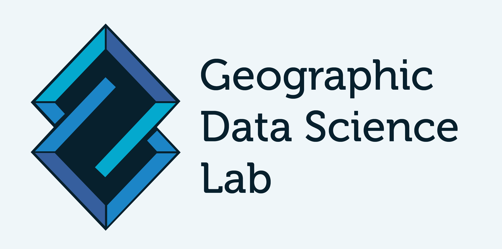

## Infrastructure

This page covers a few technical aspects on how the course is built, kept up to date, and how you can create a computational environment to run all the code it includes.

(software_stack)=
### Software stack

This course is best followed if you can not only read its content but also interact with its code and even branch out to write your own code and play on your own. For that, you will need to have installed on your computer a series of interconnected software packages; this is what we call a *stack*. You can learn more about modern stacks for scientific computing on [Block B](bB/concepts_B). 

Instructions on how to install a software stack that allows you to run the materials of this course depend on the operating system you are using. Detailed guides are available for the main systems on the following resource, provided by the [Geographic Data Science Lab](https://www.liverpool.ac.uk/geographic-data-science/):

```{toggle}
> [https://gdsl-ul.github.io/soft_install/](https://gdsl-ul.github.io/soft_install/)
```

[](https://gdsl-ul.github.io/soft_install/)

### Github repository

All the materials for this course and this website are available on the following Github repository:

```{toggle}
> [https://github.com/darribas/gds_course](https://github.com/darribas/gds_course)
```

[](https://github.com/darribas/gds_course)

If you are interested, you can download a compressed `.zip` file with the most up-to-date version of all the materials, including the HTML for this website at:

```{margin}
<SMALL>
<div>Icon made by <a href="https://www.flaticon.com/authors/freepik" title="Freepik">Freepik</a> from <a href="https://www.flaticon.com/" title="Flaticon">www.flaticon.com</a></div>
</SMALL>
```

```{toggle}
> [https://github.com/darribas/gds_course/archive/master.zip](https://github.com/darribas/gds_course/archive/master.zip)
```

[](https://github.com/darribas/gds_course/archive/master.zip)

### Continuous Integration

Following modern software engineering principles, this course is continuously tested and the website is built in an automated way. This means that, every time a new commit is built, the following two actions are triggered (click on the badges for detailed logs):

1. Automatic build of the HTML and PDF version of the course

[](https://github.com/darribas/gds_course/actions?query=workflow%3A%22Build+Jupyter+book%22)

2. Testing of the Python code that makes up the practical sections (*"Hands-on"* and *DIY*) of the course

[](https://github.com/darribas/gds_course/actions?query=workflow%3A%22Test+GDS+Course%22)

### Containerised backend

The course is developed, built and tested using the [`gds_env`](https://darribas.org/gds_env/), a containerised platform for Geographic Data Science. You can read more about the [`gds_env`](https://darribas.org/gds_env/) project at:

```{toggle}
> [https://darribas.org/gds_env/](https://darribas.org/gds_env/)
```

[](https://darribas.org/gds_env/)


### Binder

[Binder](https://mybinder.org/) is service that allows you to run scientific projects in the cloud for free. Binder can spin up *"ephemeral"* instances that allow you to run code on the browser without any local setup. It is possible to run the course on Binder by clicking on the button below:

[](https://mybinder.org/v2/gh/darribas/gds_course/master)

```{warning}
It is important to note Binder instances are *ephemeral* in the sense that the data and content created in a session is **NOT** saved anywhere and is deleted as soon as the browser tab is closed.
```

Binder is also the backend this website relies on when you click on the rocket icon (<i class="fas fa-rocket"></i>) on a page with code. Remember, you can play with the code interactively but, once you close the tab, all the changes are lost.
